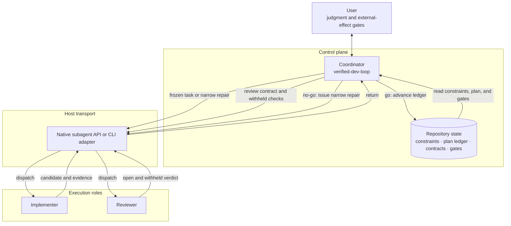

# agent-skills

Portable Agent Skills for coding and document workflows. Each
`skills/<name>/SKILL.md` is the entrypoint; copy the complete Skill directory so
its scripts and references remain available.

## Skills

| Skill | Type | Purpose |
|---|---|---|
| `branded-pptx` | bundled | Build decks from an outline on your own .pptx template, with layout verification |
| `coding-agent` | adapter | Run Codex, Claude Code, TClaude, CodeBuddy Code, or OpenCode as monitored background workers |
| `codex-delegate` | adapter | Call the Codex CLI as a job that returns a machine-readable result envelope; design informed by [openai/codex-plugin-cc](https://github.com/openai/codex-plugin-cc), implemented as a portable `codex exec --json` adapter |
| `gemini-frontend` | adapter | Use Gemini CLI for frontend design and implementation |
| `office-mpp` | bundled | Read, analyze, export, create, and edit Microsoft Project or MSPDI files |
| `openclaw-coding-agent` | adapter | Run supported coding CLIs through OpenClaw sessions and notifications |
| `pdf-to-markdown` | protocol-only | Guide a host-provided PDF-to-Markdown workflow |
| `search-docs` | adapter | Search and read the git-library documentation service |
| `skill-evolve-lite` | protocol-only | Improve a Skill through train traces, validation gates, and rollback |
| `verified-dev-loop` | protocol-only | Coordinate delegated implementation and evidence-based acceptance as a durable development loop |
| `wechat-publish` | protocol-only | Guide a host-provided WeChat publishing workflow |

The machine-readable list and delivery type are in
[`skills/catalog.json`](skills/catalog.json). `bundled` includes the core
implementation, `adapter` includes an integration with an external CLI or API,
and `protocol-only` requires the host project to provide the implementation.

## Verified development loop

`verified-dev-loop` is a control-plane protocol for the coordinating agent. The
coordinator owns scope, contracts, acceptance evidence, plan state, and stop
decisions. Native subagent APIs or CLI adapters carry role-specific work and
return artifacts; they do not decide what should pass. Implementers receive the
frozen task contract, while reviewers receive the candidate and a separate
review contract, including any checks withheld from the implementer.



The Skill remains `protocol-only`: it does not bundle a runner. A host can use
the repository's `coding-agent` or `codex-delegate` adapters, another monitored
CLI adapter, or a native subagent API to implement the transport layer.

## Install

```bash
git clone https://github.com/life-is-blue/agent-skills.git
cp -r agent-skills/skills/<name> <client-skill-directory>/
```

Read the copied `SKILL.md` before use. Client discovery directories and symlink
support vary, so verify them against the current client and a local smoke test.

## Validate

```bash
python3 scripts/validate_repo.py
python3 -m pytest -q
```

Repository changes follow [`AGENTS.md`](AGENTS.md). The default repository
license is [MIT](LICENSE); retained upstream material is listed in
[`THIRD_PARTY_NOTICES.md`](THIRD_PARTY_NOTICES.md).
