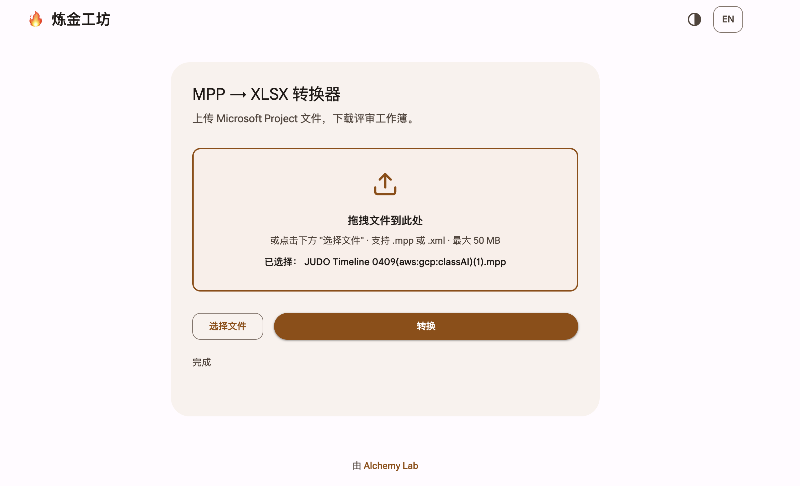

# Case 01 — The design-token trap

Real failure from 2026-05-04. Preserved so we never do this again.



## What happened

User: "用 gemini-frontend 按 Google 设计标准重构前端"

The agent's brief to Gemini:

> "Use Material 3. Seed `#f19132`. Generate tonal palette via Material Theme
> Builder. Apply M3 shape scale (card 28px, button full, input 8px), state
> layers (hover 8%, focus 10%), emphasized easing. Typography: Google Sans
> Text + Roboto Flex."

Gemini did exactly as told. Result: brand orange `#f19132` was fed through the
M3 seed algorithm, which enforces **WCAG 4.5:1 contrast on text-over-primary**.
To satisfy that with white text, the algorithm darkened primary to `#934b00`
(saddle brown) and on-primary-container to `#301400` (near-black). The page
became "M3-compliant but brand-dead" — the screenshot above.

Second attempt (polish mode, brief said "brand orange #f19132 as primary, do
not derive darker colors") produced `#7a3f15` saddle brown. **The CSS variable
system itself was re-running the contrast solver and overriding the brief.**
Polish mode couldn't reach the variable system, only re-color on top of it.

## Root cause (one line)

Technical design-system vocabulary in the brief activates automatic color /
contrast / spacing solvers that override stated brand intent.

## Anti-pattern rules this generates

1. **Never put design-system vocabulary in a Gemini brief.** The words below
   trigger baggage:
   - `Material`, `M3`, `Material Design 3`, `MD3 Expressive`
   - `design token`, `seed color`, `tonal palette`
   - `state layer`, `surface tint`, `on-primary`
   - `emphasized easing`, `motion token`, `shape scale`
   - `HIG` (Apple), `Fluent` (Microsoft) — same class of trap
2. **Use visual anchors, not vocabulary.** If the user wants a look, pass an
   image of that look via `--ref`. If they want Linear's aesthetic, get a
   Linear screenshot — don't write "use Linear-style tokens".
3. **Brand colors are literal, not seeds.** Write `primary: #f19132` and
   `on-primary: #1c1816` (dark text on bright bg) directly. Do not invite any
   algorithm to derive a "compliant" shade.
4. **Polish mode cannot uproot a color system.** If the existing CSS has
   `--md-sys-color-*` or similar computed-variable machinery, polish will
   re-color inside it, not delete it. To actually swap color systems, use
   `implement` and explicitly tell Gemini: "delete the existing CSS variable
   system, replace with 3-5 literal color variables."

## Correct brief shape (for the same task)

```
scripts/gemini-summon.sh polish "Replace the computed M3 token system with 3 literal CSS
variables: --color-primary: #f19132, --color-on-primary: #1c1816 (dark text on
bright orange, WCAG be damned — the user made this call), --color-text: #1c1816.
Delete all --md-sys-color-* variables. Match the attached baseline image's
visual language — activated orange, pill button, white card, dashed drop zone.
Hard constraints: only app/static/{index.html,app.js}, no new files, no
framework, i18n structure intact." \
  --ref baseline.png --ref current-broken.png \
  --target ../office-mpp --stream
```

Note what's gone: no "M3", no "tokens", no "shape scale". What's present: the
image is the design language anchor; literal hex values; an explicit "demolish
the token system" instruction.

## Lesson for skill maintainers

The failure didn't come from Gemini — it came from the calling agent thinking
"technical precision" meant "use the design system's vocabulary." The skill's
job is to steer the agent **away** from that instinct when the task is purely
visual. See `SKILL.md` § "Constructing the brief" for the positive rules.
